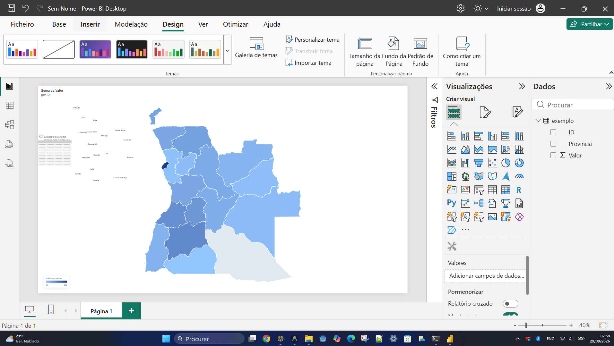

# Angola Map para Power BI

Visual personalizado para o **Microsoft Power BI** que permite apresentar dados geográficos de Angola num mapa interativo. O projecto utiliza dados geográficos nos formatos **GeoJSON**, **TopoJSON** e **SVG**, juntamente com **TypeScript**, **D3.js** e a API de visuais do Power BI.


## Exemplo



## Funcionalidades

- Visual personalizado para utilização no Power BI.
- Representação geográfica de Angola.
- Suporte para dados categóricos e medidas numéricas.
- Configuração de cores, preenchimento, tamanho do texto e apresentação dos pontos de dados.
- Dados geográficos disponíveis nos formatos GeoJSON, TopoJSON e SVG.
- Desenvolvimento baseado em TypeScript e D3.js.

## Tecnologias utilizadas

- [Power BI Visuals API](https://learn.microsoft.com/power-bi/developer/visuals/)
- TypeScript
- D3.js
- TopoJSON
- Power BI Visual Tools (`pbiviz`)
- LESS
- ESLint

## Estrutura do projecto

```text
.
├── assets/
│   ├── angola.geojson    # Dados geográficos de Angola
│   ├── angola.svg        # Representação SVG do mapa
│   ├── angola.topojson   # Dados geográficos em TopoJSON
│   └── icon.png          # Ícone do visual
├── src/
│   ├── visual.ts         # Implementação principal do visual
│   └── settings.ts       # Configurações do painel de formatação
├── style/
│   └── visual.less       # Estilos do visual
├── capabilities.json     # Dados e propriedades aceites pelo Power BI
├── pbiviz.json            # Configuração do visual Power BI
├── package.json           # Dependências e scripts
└── tsconfig.json          # Configuração do TypeScript
```

## Pré-requisitos

Antes de começar, instale:

- [Node.js](https://nodejs.org/)
- npm, incluído com o Node.js
- Power BI Visual Tools

Para instalar o Power BI Visual Tools globalmente:

```bash
npm install -g powerbi-visuals-tools
```

## Instalação

Clone o repositório e entre na pasta do projecto:

```bash
git clone https://github.com/mr-body/angola-map-powerBI.git
cd angola-map-powerBI
```

Instale as dependências:

```bash
npm install
```

## Executar em modo de desenvolvimento

Inicie o servidor de desenvolvimento do visual:

```bash
npm start
```

Por padrão, o visual fica disponível através do ambiente de desenvolvimento do Power BI Visual Tools. Durante o desenvolvimento, as alterações podem ser compiladas novamente para facilitar os testes.

## Criar o pacote `.pbiviz`

Para gerar o pacote que pode ser importado no Power BI, execute:

```bash
npm run package
```

O ficheiro `.pbiviz` será criado na pasta de saída do projecto, normalmente em `dist/`.

## Utilização no Power BI

1. Execute `npm run package` para criar o pacote do visual.
2. Abra o Power BI Desktop ou o Power BI Service.
3. No painel **Visualizações**, seleccione **Importar um visual a partir de um ficheiro**.
4. Escolha o ficheiro `.pbiviz` gerado.
5. Adicione o visual à página do relatório.
6. Arraste uma coluna categórica para **Category Data**.
7. Arraste uma medida numérica para **Measure Data**.
8. Utilize o painel de formatação para personalizar cores, preenchimento e tamanho do texto.

## Dados esperados

O visual disponibiliza duas funções de dados:

- **Category Data**: categoria associada à área ou região apresentada no mapa.
- **Measure Data**: valor numérico utilizado para análise e apresentação no visual.

Os nomes das categorias devem corresponder às regiões representadas pelos dados geográficos utilizados pelo projecto.

## Validação e qualidade do código

Para verificar problemas de lint no código:

```bash
npm run lint
```

## Licença

Este projecto está distribuído sob a licença **MIT**. Consulte o ficheiro de configuração do projecto e os avisos de licença incluídos no código-fonte para mais informações.

## Autor

**Walter Alexandre Santana**

- Repositório: [mr-body/angola-map-powerBI](https://github.com/mr-body/angola-map-powerBI)
- Problemas e sugestões: [GitHub Issues](https://github.com/mr-body/angola-map-powerBI/issues)
